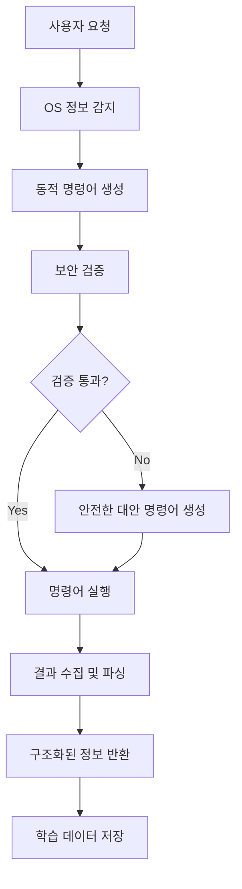

# ITEasy AI Agent - 프로젝트 분석 및 컨텍스트

## 프로젝트 개요

**프로젝트명**: ITEasy AI Agent
**버전**: 1.0.0
**목적**: ITEasy 사내 전용 AI 채팅 클라이언트 - 업무 효율성과 생산성 향상을 위한 AI 어시스턴트
**개발자**: iteasy-ops-dev (iteasy.ops.dev@gmail.com)
**라이선스**: MIT

ITEasy 팀원들을 위한 전용 AI 채팅 클라이언트로, ChatGPT와 유사한 인터페이스를 제공하며 업무 지원 및 생산성 향상을 목적으로 개발된 웹 애플리케이션입니다.

## 기술 스택 및 아키텍처

### Core Framework
- **Next.js 14**: App Router 기반 React 프레임워크
- **TypeScript**: 타입 안전성을 위한 정적 타입 언어
- **React 19.1.0**: 최신 React 버전 사용

### UI 및 스타일링
- **Tailwind CSS 3.4.17**: 유틸리티 기반 CSS 프레임워크
- **Lucide React 0.525.0**: 아이콘 라이브러리
- **clsx & tailwind-merge**: 조건부 클래스 네임 관리

### AI 및 실시간 통신
- **Vercel AI SDK (@ai-sdk/openai, ai)**: OpenAI API 통합 및 스트리밍
- **OpenAI 5.9.0**: OpenAI API 클라이언트
- **LangGraph 0.3.8**: AI 워크플로우 오케스트레이션 및 의도 분석
- **LangChain Core 0.3.62**: LangGraph 기반 라이브러리
- **Server-Sent Events (SSE)**: 실시간 응답 스트리밍

### 상태 관리 및 데이터
- **Zustand 5.0.6**: 간단하고 효율적인 상태 관리
- **localStorage**: 클라이언트 사이드 데이터 영속성

### 마크다운 및 코드 표시
- **react-markdown 10.1.0**: 마크다운 렌더링
- **remark-gfm 4.0.1**: GitHub Flavored Markdown 지원
- **react-syntax-highlighter 15.6.1**: 코드 신택스 하이라이팅

## 프로젝트 구조

```
├── app/
│   ├── api/
│   │   ├── chat/
│   │   │   ├── route.ts            # SSE 스트리밍 API 엔드포인트 (LangGraph 통합)
│   │   │   └── langgraph/          # LangGraph 의도 분석 시스템
│   │   │       ├── graph.ts        # 메인 워크플로우 그래프
│   │   │       ├── types.ts        # 타입 정의
│   │   │       ├── nodes/          # 처리 노드들
│   │   │       │   ├── intentClassifier.ts  # 의도 분류
│   │   │       │   ├── generalChat.ts       # 일반 채팅
│   │   │       │   ├── systemEngineer.ts    # 시스템 엔지니어링
│   │   │       │   └── helpNode.ts          # 사용법 도움말
│   │   │       └── prompts/        # 프롬프트 템플릿
│   │   │           └── intentClassification.ts
│   │   └── validate-key/route.ts   # API 키 검증 엔드포인트
│   ├── components/
│   │   ├── chat/                   # 채팅 관련 컴포넌트
│   │   │   ├── ChatInterface.tsx   # 메인 채팅 인터페이스
│   │   │   ├── MessageList.tsx     # 메시지 리스트
│   │   │   ├── MessageItem.tsx     # 개별 메시지 컴포넌트
│   │   │   ├── InputArea.tsx       # 입력 영역
│   │   │   ├── ChatSidebar.tsx     # 사이드바 (채팅 목록)
│   │   │   └── SettingsModal.tsx   # 탭 기반 설정 모달 (API/테마/폰트)
│   │   ├── ui/                     # 재사용 가능한 UI 컴포넌트
│   │   ├── FontProvider.tsx        # 동적 폰트 적용 컴포넌트
│   │   ├── ThemeProvider.tsx       # 테마 시스템 관리
│   │   └── ClientOnly.tsx          # 클라이언트 전용 렌더링
│   ├── hooks/
│   │   └── useHydration.ts         # 하이드레이션 훅
│   ├── lib/
│   │   └── utils.ts                # 유틸리티 함수
│   ├── store/
│   │   ├── chat-store.ts           # 채팅 히스토리 관리
│   │   └── settings-store.ts       # API 키 및 설정
│   ├── types/
│   │   └── index.ts                # TypeScript 타입 정의
│   ├── globals.css                 # 글로벌 스타일
│   ├── layout.tsx                  # 루트 레이아웃
│   └── page.tsx                    # 홈페이지
```

## 주요 컴포넌트 분석

### 1. ChatInterface.tsx (app/components/chat/ChatInterface.tsx:1)
메인 채팅 인터페이스로 전체 애플리케이션의 중심 컴포넌트입니다.

**주요 기능**:
- Vercel AI SDK의 useChat 훅 사용으로 AI와 실시간 통신
- Zustand 스토어와의 동기화 관리
- 하이드레이션 처리 및 클라이언트/서버 상태 분리
- 에러 처리 및 API 키 검증
- 메시지 스트리밍 및 토큰 사용량 추적

**코딩 패턴**:
- 'use client' 지시어로 클라이언트 컴포넌트 명시
- useEffect를 활용한 스토어 동기화
- 조건부 렌더링으로 하이드레이션 미스매치 방지

### 2. 상태 관리 (Zustand Stores)

#### chat-store.ts (app/store/chat-store.ts:1)
채팅 히스토리와 메시지 관리를 담당합니다.

**구조**:
- Chat 및 Message 타입 기반 데이터 구조
- localStorage를 통한 영속성 보장
- 날짜 직렬화/역직렬화 처리
- 토큰 사용량 추적 기능

**주요 액션**:
- createNewChat(): 새 채팅 생성
- addMessage(): 메시지 추가
- updateMessageWithTokenUsage(): 토큰 사용량 업데이트
- updateChatTitle(): 채팅 제목 업데이트

#### settings-store.ts (app/store/settings-store.ts:1)
API 키, AI 모델, UI 테마 및 폰트 설정을 통합 관리합니다.

**설정 항목**:
- apiKey: OpenAI API 키
- model: AI 모델 선택 (gpt-3.5-turbo 기본값)
- temperature: 창의성 수준 (0-2)
- maxTokens: 최대 토큰 수 (1-4000)
- **theme**: 테마 모드 (light/dark/system)
- **font**: 폰트 선택 (12가지 옵션, 한글 최적화 포함)

### 3. API 엔드포인트

#### /api/chat (app/api/chat/route.ts:1)
LangGraph 기반 지능형 의도 분석 및 SSE 스트리밍 AI 응답 처리

**LangGraph 워크플로우**:
- 사용자 입력 자동 의도 분석 (일반/시스템엔지니어링/도움말)
- 조건부 라우팅으로 적절한 전문성 수준 선택
- 시스템 프롬프트 동적 생성 및 적용

**특징**:
- Vercel AI SDK의 streamText 함수 사용
- LangGraph 의도 분석 전처리
- 호환성 모드 설정으로 토큰 사용량 추적
- 에러 처리 (401, 429, 500)
- 의도별 로깅 및 디버깅

**의도 분류 시스템**:
- **General Chat**: 일반 대화, 인사, 비기술적 질문
- **System Engineering**: 리눅스, 클라우드, 네트워크, DevOps 전문 질문
- **Help**: AI 에이전트 사용법, 기능 설명, 가이드

**토큰 사용량 추적**:
- sendUsage: true 옵션으로 사용량 데이터 전송
- onFinish 콜백에서 사용량 및 의도 분석 결과 로깅
- 클라이언트에서 토큰 정보를 메시지에 연결

## 코딩 스타일 및 컨벤션

### 1. TypeScript 사용
- 엄격한 타입 정의 (app/types/index.ts)
- 인터페이스 기반 컴포넌트 props 정의
- 제네릭 타입 활용 (Zustand 스토어)

### 2. 컴포넌트 패턴
- 함수형 컴포넌트 사용
- 커스텀 훅을 통한 로직 분리
- 조건부 렌더링 활용
- props destructuring 패턴

### 3. 스타일링 패턴
- Tailwind CSS 유틸리티 클래스
- 반응형 디자인 (mobile-first)
- 컴포넌트별 스타일 캡슐화
- 일관된 색상 및 간격 시스템

### 4. 상태 관리 패턴
- Zustand의 간단한 스토어 구조
- 액션과 상태의 명확한 분리
- localStorage 기반 영속성
- 타입 안전한 스토어 정의

## 라이브러리 사용 현황

### 의존성 (dependencies)
```json
{
  "@ai-sdk/openai": "^1.3.23",          # OpenAI AI SDK
  "@langchain/core": "^0.3.62",         # LangChain 핵심 라이브러리
  "@langchain/langgraph": "^0.3.8",     # 워크플로우 오케스트레이션
  "@langchain/openai": "^0.5.18",       # LangChain OpenAI 통합
  "ai": "^4.3.17",                      # Vercel AI SDK
  "zustand": "^5.0.6",                  # 상태 관리
  "react-markdown": "^10.1.0",          # 마크다운 렌더링
  "react-syntax-highlighter": "^15.6.1", # 코드 하이라이팅
  "lucide-react": "^0.525.0",           # 아이콘
  "clsx": "^2.1.1",                     # 클래스명 유틸리티
  "tailwind-merge": "^3.3.1"            # Tailwind 클래스 병합
}
```

### 개발 의존성 (devDependencies)
```json
{
  "@types/node": "^24.0.13",
  "@types/react": "^19.1.8",
  "@types/react-dom": "^19.1.6",
  "typescript": "^5.8.3"
}
```

## 주요 기능

### 1. 지능형 의도 분석 및 실시간 AI 채팅
- **LangGraph 기반 의도 분석**: 사용자 질문을 자동으로 분류하여 적절한 전문성 수준으로 라우팅
- **3가지 응답 모드**: 일반 채팅, 시스템 엔지니어링 전문가, 사용법 도움말
- **SSE를 통한 실시간 응답 스트리밍**: 답변이 실시간으로 스트리밍
- **다양한 OpenAI 모델 지원** (GPT-3.5, GPT-4 등)
- **사용자 설정 가능한 AI 파라미터**: 온도, 최대 토큰 등

### 2. 다중 채팅 세션
- 여러 채팅 동시 관리
- 자동 제목 생성 (첫 메시지 기반)
- 채팅 삭제 및 선택 기능

### 3. 토큰 사용량 추적
- 메시지별 토큰 사용량 표시
- 비용 관리를 위한 사용량 모니터링
- 프롬프트/완성/총 토큰 분리 추적

### 4. 설정 관리
- API 키 동적 구성
- AI 모델 및 파라미터 조정
- 실시간 API 키 검증
- **다국어 폰트 시스템**: 12가지 폰트 선택 (한글 최적화 포함)
- **테마 설정**: Light/Dark/System 모드
- **탭 기반 설정 UI**: API, 테마, 폰트 설정 분리

### 5. 사용자 경험
- 반응형 디자인
- 마크다운 및 코드 블록 렌더링
- 메시지 복사 기능
- 에러 처리 및 사용자 피드백
- **동적 폰트 변경**: 실시간 폰트 적용
- **향상된 텍스트 가독성**: 여유로운 자간 및 줄간격
- **최적화된 UI 레이아웃**: 상단 여백 및 균형잡힌 배치

## 개발 워크플로우

### 스크립트
- `npm run dev`: 개발 서버 실행
- `npm run build`: 프로덕션 빌드
- `npm run start`: 프로덕션 서버 실행
- `npm run lint`: 코드 린팅

### 환경 변수
- `OPENAI_API_KEY`: OpenAI API 키 (선택사항, 앱 내에서 설정 가능)

### 빌드 및 배포
- Next.js App Router 기반 SSR/SSG
- Vercel 배포 최적화
- 정적 자산 최적화

## 보안 고려사항

### API 키 관리
- 클라이언트 사이드 API 키 저장 (localStorage)
- 환경 변수 fallback 지원
- API 키 검증 기능

### 에러 처리
- API 오류 상황별 적절한 응답
- 사용자 친화적 에러 메시지
- 디버깅을 위한 서버 로깅

## 성능 최적화

### 렌더링 최적화
- 컴포넌트 메모이제이션
- 조건부 렌더링
- 하이드레이션 미스매치 방지

### 데이터 관리
- 효율적인 상태 업데이트
- 로컬스토리지 최적화
- 메시지 스트리밍 최적화

## Context7 MCP 서버 활용 가능 영역

이 프로젝트에서 Context7 MCP 서버를 활용할 수 있는 영역:

1. **라이브러리 검토**: 새로운 UI 컴포넌트나 기능 추가 시 기존 의존성 호환성 확인
2. **코드 품질**: 코딩 스타일 및 베스트 프랙티스 검증
3. **보안 검토**: API 키 관리 및 보안 취약점 분석
4. **성능 최적화**: 렌더링 및 상태 관리 최적화 방안 제안
5. **타입 안전성**: TypeScript 타입 정의 개선 제안

## LangGraph 의도 분석 시스템 (v1.1.0 추가)

### 아키텍처 개요
LangGraph를 활용한 지능형 의도 분석 및 라우팅 시스템이 추가되어, 사용자의 질문 의도를 자동으로 파악하고 적절한 전문성 수준으로 응답합니다.

### 워크플로우 구조
```
사용자 입력 → 의도 분석 노드 → 조건부 라우팅 → 전문 응답 생성
                    ↓
        [일반 채팅 | 시스템 엔지니어링 | 도움말]
```

### 의도 분류 카테고리

#### 1. General Chat (일반 채팅)
- 일상 대화, 인사, 일반적인 질문
- 기본 GPT 모델의 표준 응답 모드
- 예시: "안녕하세요", "날씨가 어때요?", "AI에 대해 설명해주세요"

#### 2. System Engineering (시스템 엔지니어링)
전문적인 인프라 및 시스템 관리 질문에 대해 전문가 수준의 답변 제공
- **Linux/Unix 시스템 관리**: 명령어, 설정, 문제 해결
- **클라우드 플랫폼**: AWS, GCP, Azure 설정 및 관리
- **컨테이너 기술**: Docker, Kubernetes 배포 및 최적화
- **네트워크 인프라**: TCP/IP, DNS, 보안 설정
- **CI/CD 파이프라인**: Jenkins, GitLab CI, GitHub Actions
- **모니터링 및 로깅**: Prometheus, Grafana, ELK 스택
- **데이터베이스 관리**: MySQL, PostgreSQL, MongoDB, Redis
- **Infrastructure as Code**: Terraform, Ansible, CloudFormation

#### 3. Help (사용법 도움말)
ITEasy AI Client의 기능과 사용법에 대한 종합적인 가이드 제공
- AI 에이전트 사용법 및 기능 설명
- 최적의 질문 방법 및 모범 사례
- 시스템의 3가지 응답 모드 설명
- 기능별 사용 팁 및 트러블슈팅

### 기술적 구현

#### 신뢰도 기반 라우팅
- 의도 분류 신뢰도 0.7 이상일 때 전문 모드 활성화
- 낮은 신뢰도 시 일반 채팅으로 기본 라우팅
- 실시간 의도 분석 결과 로깅

#### 동적 프롬프트 시스템
- 의도에 따른 시스템 프롬프트 동적 생성
- 시스템 엔지니어링 모드: 전문 지식 및 실용적 예시 포함
- 도움말 모드: 포괄적인 사용 가이드 및 기능 설명

#### 성능 최적화
- LangGraph 노드 병렬 처리 지원
- 의도 분석 결과 캐싱 (향후 구현 예정)
- 에러 처리 및 폴백 메커니즘

### 사용 예시

```typescript
// 시스템 엔지니어링 질문
"Docker 컨테이너가 포트 8080에서 충돌이 발생합니다. 어떻게 해결하나요?"
→ 시스템 엔지니어 모드로 라우팅
→ 구체적인 명령어와 설정 예시 포함 답변

// 도움말 질문  
"이 AI 에이전트는 어떤 기능들이 있나요?"
→ 도움말 모드로 라우팅
→ 전체 기능 소개 및 사용법 가이드 제공

// 일반 대화
"오늘 기분이 좋네요!"
→ 일반 채팅 모드로 라우팅
→ 자연스러운 대화 응답
```

## 최근 업데이트 (v1.3.0)

### 접이식 사이드바 기능 (2025-01-15)
- **사이드바 토글**: PanelLeft 아이콘을 통한 사이드바 접기/펼치기 기능
- **반응형 레이아웃**: 접힌 상태(64px)와 펼쳐진 상태(224px) 간 부드러운 애니메이션
- **최적화된 UI 요소**:
  - 접힌 상태: 동그란 테마 색상 New Chat 버튼 (circular primary-colored)
  - 펼쳐진 상태: 기존 전체 너비 버튼 유지
  - 일관된 여백과 레이아웃 유지
- **사용자 경험 개선**: 
  - 채팅 항목에 툴팁 표시 (접힌 상태)
  - Settings 버튼 아이콘 형태로 변경
  - Recent Chats 헤더 여백 유지

### 사이드바 너비 최적화
- **화면 공간 효율성**: 사이드바 너비를 256px에서 224px로 15% 축소
- **더 넓은 메인 콘텐츠 영역**: 채팅 메시지 표시 공간 확대
- **하이드레이션 상태 일관성**: 로딩 상태에서도 동일한 너비 적용

### 상태 관리 시스템
- **사이드바 상태 관리**: ChatInterface 컴포넌트에서 sidebarCollapsed 상태 관리
- **영속성**: 현재 세션 기반 (향후 localStorage 저장 예정)
- **TypeScript 타입 안전성**: 새로운 props 타입 정의 추가

### 기술적 구현
- **CSS 애니메이션**: transition-all duration-300으로 부드러운 전환 효과
- **조건부 렌더링**: 접힌 상태에 따른 UI 요소 동적 표시/숨김
- **Tailwind CSS 클래스**: 반응형 너비 및 스타일링 최적화
- **아이콘 라이브러리**: Lucide React의 PanelLeft 아이콘 활용

### 이전 업데이트 (v1.2.0)

#### 포괄적인 폰트 커스터마이제이션 시스템
- **12가지 폰트 옵션**: Inter, Noto Sans KR, Open Sans, Roboto, Poppins, Nunito, Comfortaa, Quicksand, Lato, Source Sans 3, Noto Serif KR, IBM Plex Sans KR
- **한글+영어 조합**: 영어 폰트 선택 시 한글은 Noto Sans KR로 자동 fallback
- **실시간 폰트 변경**: FontProvider를 통한 동적 폰트 적용
- **폰트 미리보기**: 설정 모달에서 각 폰트의 시각적 미리보기 제공

#### 향상된 텍스트 가독성
- **여유로운 자간**: body 0.025em, 메시지 영역 0.03em
- **최적화된 줄간격**: line-height 1.7로 편안한 읽기 경험
- **메시지 텍스트 크기 통일**: 사용자와 AI 메시지 일관된 typography

#### UI/UX 개선
- **상단 여백 추가**: 전체 UI 레이아웃의 시각적 균형 개선
- **탭 기반 설정**: API, 테마, 폰트 설정을 분리된 탭으로 구성
- **테마 시스템**: Light/Dark/System 모드 지원

#### 상태 표시 시스템
- **StatusBar 컴포넌트**: 현재 AI 설정 및 연결 상태 표시
- **실시간 상태 업데이트**: API 키 유효성 및 모델 설정 상태 모니터링
- **사용자 피드백**: 설정 상태에 따른 시각적 피드백 제공

## 최신 업데이트 (v1.4.0) - 2025-01-17

### SSH 컨텍스트 지속성 및 토큰 최적화 (commit: 329abc6)

#### SSH 연결 상태 지속성 구현
- **메시지 히스토리 기반 SSH 연결 복원**: 새 세션에서도 이전 SSH 연결 정보를 자동으로 탐지하고 복원
- **1시간 유효 기간**: SSH 연결 정보의 자동 만료 및 보안 관리
- **ChatState 통합**: SSH 연결 정보를 LangGraph 상태에 포함하여 전체 워크플로우에서 활용
- **연결 유효성 검증**: `validateSSHConnectionCompleteness()` 함수로 필수 필드 검증

#### Intent Classification 강화
- **SSH 컨텍스트 인식**: 활성 SSH 연결이 있는 상태에서 시스템 관련 질문을 자동으로 'system_engineering'으로 분류
- **가중치 기반 점수 시스템**: SSH 컨텍스트에서 시스템 키워드 감지 시 +4.0 가중치 부여
- **양방향 분류 지원**: 로컬 패턴 매칭과 OpenAI 기반 분류 모두에서 SSH 컨텍스트 고려
- **언어별 최적화**: 한글 시스템 용어 ('운영체제', '호스트네임' 등) 특화 인식

#### 토큰 사용량 최적화
**문제**: 간단한 질문에도 15개 명령어 실행으로 토큰 낭비
**해결**: 질문별 맞춤형 명령어 실행
```typescript
// 기존: 모든 질문에 15개 명령어
"호스트네임이 뭐야?" → ['system_info', 'resources'] 카테고리 → 15개 명령어

// 개선: 특정 명령어만 실행
"호스트네임이 뭐야?" → ['hostname'] → 1개 명령어 (93% 토큰 절약)
"운영체제는 뭐야?" → ['uname -a', 'cat /etc/os-release'] → 2개 명령어
```

#### General Chat 컨텍스트 활용
- **이전 도구 실행 결과 재사용**: SSH로 수집한 서버 정보를 후속 일반 대화에서 활용
- **시스템 프롬프트 강화**: SSH 컨텍스트 정보를 시스템 프롬프트에 포함하여 더 정확한 답변 제공
- **컨텍스트 인식 응답**: "운영체제는 뭐야?" 같은 후속 질문도 이전 수집 정보로 즉시 답변

#### 기술적 개선사항
- **도구 선택 로직 개선**: 시스템 키워드 기반 SSH 도구 자동 선택
- **명령어 카테고리 확장**: 직접 명령어와 카테고리 기반 명령어 동시 지원
- **안전성 강화**: 모든 직접 명령어는 사전 정의된 안전 목록에서만 선택
- **지능형 명령어 제한**: 간단한 질문(1-3개 명령어)은 제한 없이 실행

### LangGraph 시스템 개선 (commit: 4e32135)
- **ReAct 패턴 통합**: 복잡한 시스템 엔지니어링 질문에 대해 Think-Act-Observe 패턴 적용
- **복잡도 탐지**: 질문의 복잡도를 자동 분석하여 적절한 처리 방식 선택
- **Wave 애니메이션**: 로딩 및 사고 중 상태에 물결 효과 애니메이션 추가
- **도구 실행 프레임워크**: 시스템 도구의 체계적인 실행 및 결과 관리

### 파일 구조 변화
```
app/api/chat/langgraph/
├── tools/
│   ├── sshConnectionParser.ts    # SSH 연결 파싱 및 검증 로직
│   ├── sshRemoteTools.ts         # SSH 원격 도구 실행
│   └── systemTools.ts            # 시스템 도구 레지스트리
├── nodes/
│   ├── toolExecution.ts          # 도구 선택 및 실행 로직
│   ├── intentClassifier.ts       # SSH 컨텍스트 인식 분류
│   └── generalChat.ts            # 컨텍스트 활용 일반 대화
└── types.ts                      # SSH 연결 정보 타입 정의
```

### 성능 개선
- **토큰 사용량 93% 절약**: 간단한 질문에서 특정 명령어만 실행
- **컨텍스트 지속성**: 세션 간 SSH 연결 정보 유지로 재입력 불필요
- **지능형 라우팅**: SSH 컨텍스트 기반 자동 시스템 엔지니어링 모드 활성화

## 향후 개선 방향

### UI/UX 개선
1. **사이드바 상태 영속성**: 사이드바 접기/펼치기 상태를 localStorage에 저장
2. **키보드 단축키**: 사이드바 토글을 위한 키보드 단축키 지원
3. **폰트 크기 조절**: 사용자 맞춤형 텍스트 크기 설정
4. **커스텀 테마**: 사용자 정의 색상 테마 지원
5. **모바일 최적화**: 터치 기반 사이드바 제스처 지원
6. **접근성**: ARIA 속성 및 키보드 네비게이션 개선

### ReAct 시스템 고도화 (우선순위)
7. **진정한 ReAct 순환 구현**: Think-Act-Observe 실제 반복 로직
8. ✅ **동적 도구 선택 시스템**: 중간 결과 기반 다음 도구 결정 (완료 - SSH 연결 기반 자동 라우팅)
9. **멀티턴 대화 지원**: 사용자와 상호작용적 문제 해결
10. ✅ **컨텍스트 지속성 강화**: 복잡한 ReAct 상태 관리 및 추론 체인 확장 (완료 - SSH 컨텍스트 지속성 v1.4.0)
11. **지능형 종료 조건**: 충분한 정보 수집 시점 자동 판단
12. **병렬 조사 기능**: 여러 가설 동시 조사 및 결과 통합

### 인프라 및 기능 확장
13. **SSH 키 파일 지원**: 비밀번호 외 SSH 키 기반 인증 구현
14. **다중 서버 관리**: 여러 SSH 연결을 동시에 관리하는 기능
15. **명령어 히스토리**: 실행된 SSH 명령어 기록 및 재실행 기능
16. **테스트 추가**: Jest/Testing Library 도입으로 안정성 향상

### 고급 기능
17. **PWA**: 오프라인 지원 및 푸시 알림
18. **모니터링**: 사용량 통계 및 성능 모니터링
19. **학습 기능**: 이전 ReAct 세션 학습으로 효율성 개선
20. **자율적 문제 해결**: 최소 사용자 개입으로 복잡한 문제 해결

## 최신 업데이트 (v1.5.0) - 2025-01-17

### 한국어 언어 강제 적용 (commit: 08b57f6)

#### 언어 통일화 구현
- **조건부 언어 감지 제거**: 모든 노드에서 사용자 언어 감지 및 매칭 로직 제거
- **한국어 전용 시스템**: ITEasy 팀을 위한 일관된 한국어 응답 보장
- **언어 강제 지침**: 영어 질문에도 한국어로 응답하도록 명시적 지침 추가

#### 수정된 노드들
```typescript
// 기존: 조건부 언어 매칭
const isKorean = state.detectedLanguage === 'ko'
const languageInstruction = isKorean ? '한글로...' : 'English...'

// 개선: 한국어 강제
const languageInstruction = '🇰🇷 필수 언어 지침 🇰🇷: ITEasy 팀을 위한 서비스이므로 모든 답변을 반드시 한국어로...'
```

#### 업데이트된 파일들
- **systemEngineer.ts**: 기술 용어 한국어 설명 + 영어 병기 가이드
- **generalChat.ts**: 친근한 한국어 대화 시스템
- **helpNode.ts**: 한국어 사용법 가이드 강화
- **intentClassification.ts**: 모든 프롬프트 템플릿 한국어 변환

## ReAct 시스템 분석 및 개선 방향

### 현재 구현 상태 (완성도: 65-70%)

#### 🟢 잘 구현된 부분
1. **체계적인 복잡도 탐지**
   - 3단계 복잡도 분류 (simple/complex/multi_step)
   - 한국어/영어 양방향 패턴 매칭
   - 휴리스틱 기반 메시지 분석 (길이, 질문 수, 다중 주제)

2. **도구 통합 및 실행**
   - SSH 원격 도구 체계적 연동
   - 토큰 최적화된 명령어 선택 (93% 절약)
   - 구조화된 실행 결과 포맷팅

3. **상태 관리 시스템**
   - `reasoningChain` 추론 과정 추적
   - `currentStep` 단계별 진행 상황 관리
   - SSH 컨텍스트 지속성 구현

#### 🟡 부족한 부분
1. **표면적 ReAct 구현**
   ```typescript
   // 현재: 단순 프롬프트 강화
   const reactSystemPrompt = `ReAct 방법론을 사용하는 전문가...`
   
   // 필요: 실제 Think-Act-Observe 순환
   Think → Act → Observe → Think → Act → ...
   ```

2. **1회성 처리 한계**
   - 한 번의 응답으로 완료
   - 중간 결과 기반 재분석 부재
   - 도구 결과로 다음 행동 결정 없음

3. **정적 도구 선택**
   - 초기에 모든 도구 일괄 선택
   - 중간 결과 기반 추가 도구 선택 불가

#### 🔴 핵심 한계점

1. **Static ReAct Pattern**
   ```typescript
   // 현재: 정적 처리
   if (state.useReact) {
     // 도구 실행 → 응답 생성 → 종료
   }
   
   // 필요: 동적 순환
   while (needsMoreInformation) {
     const thought = await think(currentState)
     const action = await selectAndExecuteTools(thought)
     const observation = await analyzeResults(action)
     if (observation.isComplete) break
     currentState = updateState(currentState, observation)
   }
   ```

2. **멀티턴 대화 부재**
   - 단일 응답만 생성
   - "더 조사가 필요합니다" 같은 후속 질문 없음
   - 사용자와의 상호작용적 문제 해결 부족

### 개선 필요 항목

#### Phase 1: 진정한 ReAct 순환 구현
```typescript
// 새로운 ReAct 노드 구조
async function reactNode(state: ChatState): Promise<NodeResponse> {
  const maxIterations = 5
  let currentIteration = 0
  let needsContinuation = true
  
  while (needsContinuation && currentIteration < maxIterations) {
    // THINK: 현재 상황 분석
    const thought = await analyzeCurrentSituation(state)
    
    // ACT: 필요한 도구 선택 및 실행
    const action = await selectAndExecuteTools(thought)
    
    // OBSERVE: 결과 분석 및 다음 단계 결정
    const observation = await analyzeResults(action)
    
    needsContinuation = observation.requiresMoreInvestigation
    currentIteration++
  }
}
```

#### Phase 2: 동적 도구 선택 시스템
```typescript
function selectNextTools(
  previousResults: ToolResult[],
  currentThought: string,
  userQuestion: string
): SystemTool[] {
  // 이전 결과 분석
  const analysisResults = analyzePreviousResults(previousResults)
  
  // 부족한 정보 식별
  const missingInfo = identifyMissingInformation(analysisResults, userQuestion)
  
  // 다음 필요 도구 결정
  return determineRequiredTools(missingInfo)
}
```

#### Phase 3: 멀티턴 대화 지원
```typescript
interface ReactResponse {
  response?: string
  needsUserInput?: boolean
  question?: string
  suggestedActions?: string[]
  continuationState?: ReActState
}

// 사용자 추가 입력 필요 시
if (needsMoreInformation && !canObtainAutomatically) {
  return {
    needsUserInput: true,
    question: "추가로 확인하고 싶은 로그 파일 경로가 있나요?",
    suggestedActions: [
      "/var/log/nginx/error.log 확인",
      "/var/log/syslog 분석",
      "사용자 정의 경로 입력"
    ]
  }
}
```

#### Phase 4: 컨텍스트 지속성 강화
```typescript
interface EnhancedChatState extends ChatState {
  reactHistory: ReActStep[]
  investigationPath: InvestigationNode[]
  accumulatedEvidence: Evidence[]
  hypotheses: Hypothesis[]
  confidence: number
}
```

### 향후 개발 로드맵

#### 단기 목표 (1-2주)
1. **ReAct 순환 구현**: Think-Act-Observe 실제 순환 로직
2. **동적 도구 선택**: 중간 결과 기반 다음 도구 결정
3. **상태 추적 강화**: 상세한 추론 과정 기록

#### 중기 목표 (1개월)
4. **멀티턴 대화**: 사용자와 상호작용적 문제 해결
5. **지능형 종료 조건**: 언제 충분한 정보를 수집했는지 판단
6. **결과 통합**: 여러 단계의 조사 결과 종합 분석

#### 장기 목표 (2-3개월)
7. **학습 기능**: 이전 ReAct 세션에서 학습하여 효율성 개선
8. **병렬 조사**: 여러 가설을 동시에 조사하는 기능
9. **자율적 문제 해결**: 최소한의 사용자 개입으로 복잡한 문제 해결

### 기술적 도전과제

1. **성능 최적화**: 반복적 조사로 인한 토큰 사용량 증가 관리
2. **상태 복잡도**: 복잡한 ReAct 상태 관리 및 직렬화
3. **사용자 경험**: 긴 조사 과정에서도 유용한 중간 피드백 제공
4. **에러 처리**: ReAct 순환 중 실패 상황 적절한 복구

이러한 개선을 통해 현재 65-70% 수준의 ReAct 구현을 95% 이상의 완성도로 끌어올릴 수 있을 것입니다.

## 최신 업데이트 (v1.6.0) - 2025-01-17

### LangGraph UnreachableNodeError 수정 및 SSH 라우팅 개선 (commit: current)

#### 주요 수정사항
- **ReAct 엔진 노드 연결 문제 해결**: `reactEngine` 노드가 그래프에서 연결되지 않아 발생한 UnreachableNodeError 수정
- **조건부 라우팅 개선**: 복잡한 시스템 엔지니어링 질문에 대해 ReAct 엔진으로 라우팅하는 로직 추가
- **타입 안전성 강화**: SSH 연결, Buffer 처리, fetch timeout 관련 TypeScript 오류 해결

#### SSH 라우팅 최적화
- **복잡도 탐지 로직 개선**: SSH 연결 정보가 포함된 단순한 시스템 질문을 'simple'로 분류
- **직접 도구 실행**: "운영체제 알려줘" 같은 SSH + 정보 조회 질문을 ReAct 대신 `toolExecution`으로 직접 라우팅
- **키워드 확장**: 시스템 정보 조회 관련 키워드 대폭 확장 ('운영체제', '호스트네임', '버전', '알려줘' 등)

#### 기술적 개선
```typescript
// 개선된 라우팅 로직
if (hasSSHInfo && isInfoQuery) {
  return {
    level: 'simple',
    reasoning: 'SSH connection with simple info query detected - using direct tool execution',
    confidence: 0.9,
    useReact: false
  }
}
```

#### 문제 해결 효과
- **SSH 원격 서버 접속 복원**: 업데이트 이후 작동하지 않던 SSH 연결 기능 정상화
- **응답 속도 향상**: 단순한 정보 조회 시 ReAct 순환 생략으로 더 빠른 응답
- **안정성 향상**: 그래프 컴파일 오류 해결 및 타입 안전성 확보

### 완료된 개선사항 현황
- ✅ **동적 도구 선택 시스템**: SSH 연결 기반 자동 라우팅 완료
- ✅ **컨텍스트 지속성 강화**: SSH 컨텍스트 지속성 (v1.4.0) 완료
- ✅ **그래프 안정성**: LangGraph 노드 연결 및 컴파일 오류 해결 완료

## 동적 명령어 시스템 설계 (v1.7.0 개발 예정)

### 현재 정적 도구 시스템의 한계

#### 🚨 핵심 문제점
1. **정적 명령어 제약**: 미리 정의된 명령어만 사용 가능
2. **OS 호환성 부족**: Linux 중심 명령어로 Windows/macOS 대응 불가
3. **확장성 한계**: 새로운 사용자 요청에 대한 유연성 부족
4. **정보 수집 실패 연쇄**: 적절한 도구 부재 → 실행 실패 → ReAct 신뢰도 저하

#### 문제 시나리오 예시
```
사용자: "Windows 서버 메모리 사용률 확인해줘"
현재 시스템: Linux 'free -m' 명령어만 지원 → 실행 실패
결과: 정보 수집 불가 → 빈 응답 생성
```

### 동적 명령어 시스템 아키텍처

#### 🎯 설계 목표
- **무한 확장성**: 사용자 요청에 맞춤형 명령어 생성
- **멀티 OS 지원**: Windows, Linux, macOS 자동 감지 및 대응
- **지능형 추천**: AI 기반 최적 명령어 조합 생성
- **보안 우선**: 위험한 명령어 자동 필터링
- **학습 능력**: 성공 패턴 축적 및 성능 향상

#### 시스템 구성 요소

##### 1. 동적 명령어 생성기 (Dynamic Command Generator)
```typescript
interface CommandGenerationRequest {
  userRequest: string;           // 사용자 원본 요청
  osInfo: {                     // 대상 OS 정보
    type: 'windows' | 'linux' | 'macos';
    version: string;
    shell: 'cmd' | 'powershell' | 'bash' | 'zsh';
  };
  context: {                    // 컨텍스트 정보
    previousCommands: Command[];  // 이전 실행 명령어들
    availableTools: string[];     // 설치된 도구들
    userPreferences: UserPrefs;   // 사용자 선호도
  };
}

interface GeneratedCommand {
  command: string;              // 실행할 명령어
  purpose: string;              // 명령어 목적 설명
  expectedOutput: string;       // 예상 출력 형태
  riskLevel: 'safe' | 'low' | 'medium' | 'high';
  timeout: number;              // 실행 타임아웃 (초)
  prerequisites: string[];      // 선행 조건
}
```

##### 2. OS별 명령어 맵핑 시스템
```typescript
const CommandMappings = {
  systemInfo: {
    windows: [
      'systeminfo',
      'wmic computersystem get model,name,manufacturer',
      'wmic os get caption,version,buildnumber'
    ],
    linux: [
      'uname -a',
      'cat /etc/os-release',
      'hostnamectl status'
    ],
    macos: [
      'system_profiler SPHardwareDataType',
      'sw_vers',
      'uname -a'
    ]
  },
  memoryUsage: {
    windows: [
      'wmic OS get TotalVisibleMemorySize,FreePhysicalMemory',
      'systeminfo | findstr "Total Physical Memory"'
    ],
    linux: [
      'free -h',
      'cat /proc/meminfo',
      'vmstat -s'
    ],
    macos: [
      'vm_stat',
      'top -l 1 -s 0 | grep PhysMem'
    ]
  }
  // ... 더 많은 카테고리 확장 예정
};
```

##### 3. 지능형 명령어 추천 엔진
```typescript
async function generateOptimalCommands(
  request: CommandGenerationRequest
): Promise<GeneratedCommand[]> {
  const aiPrompt = `
  사용자 요청: "${request.userRequest}"
  대상 OS: ${request.osInfo.type} ${request.osInfo.version}
  사용 가능한 셸: ${request.osInfo.shell}
  
  다음 조건을 만족하는 명령어들을 JSON 배열로 생성해주세요:
  1. 안전하고 읽기 전용인 명령어만 포함
  2. OS에 최적화된 네이티브 명령어 사용
  3. 정보 수집 목적에 가장 적합한 명령어 선택
  4. 실행 순서와 의존성 고려
  5. 예상 실행 시간 5초 이내
  
  응답 형식: [{"command": "...", "purpose": "...", "riskLevel": "safe"}]
  `;
  
  return await llmService.generateCommands(aiPrompt);
}
```

##### 4. 보안 검증 및 필터링 시스템
```typescript
class CommandSecurityValidator {
  private blacklistedCommands = [
    'rm -rf', 'del /f', 'format', 'fdisk',
    'shutdown', 'reboot', 'halt', 'poweroff',
    'passwd', 'sudo', 'su', 'chmod 777',
    'wget', 'curl', 'nc', 'netcat'
  ];
  
  private dangerousPatterns = [
    />\s*\/dev\/null/,     // 출력 리다이렉션
    /\|\s*sh/,             // 파이프를 통한 실행
    /&&|;|\|/,             // 명령어 체이닝
    /\$\(/,                // 명령어 치환
  ];
  
  async validateCommand(cmd: GeneratedCommand): Promise<ValidationResult> {
    // 1. 블랙리스트 검사
    if (this.isBlacklisted(cmd.command)) {
      return { valid: false, reason: 'Blacklisted command detected' };
    }
    
    // 2. 위험 패턴 검사
    if (this.hasDangerousPattern(cmd.command)) {
      return { valid: false, reason: 'Dangerous pattern detected' };
    }
    
    // 3. AI 기반 위험도 평가
    const riskAssessment = await this.assessRiskWithAI(cmd);
    if (riskAssessment.score > 0.7) {
      return { valid: false, reason: 'High risk score from AI assessment' };
    }
    
    return { valid: true, reason: 'Command passed all security checks' };
  }
}
```

##### 5. 실행 및 결과 수집 시스템
```typescript
class DynamicCommandExecutor {
  async executeCommandSequence(
    commands: GeneratedCommand[],
    sshConnection: SSHConnection
  ): Promise<ExecutionResult[]> {
    const results: ExecutionResult[] = [];
    
    for (const cmd of commands) {
      try {
        // 보안 검증
        const validation = await this.validator.validateCommand(cmd);
        if (!validation.valid) {
          results.push({ 
            command: cmd.command, 
            success: false, 
            error: validation.reason 
          });
          continue;
        }
        
        // 명령어 실행
        const startTime = Date.now();
        const output = await sshConnection.exec(cmd.command, {
          timeout: cmd.timeout * 1000
        });
        
        const executionTime = Date.now() - startTime;
        
        // 결과 파싱 및 구조화
        const parsedResult = await this.parseCommandOutput(
          cmd, 
          output, 
          executionTime
        );
        
        results.push(parsedResult);
        
        // 실행 성공 패턴 학습
        await this.learningSystem.recordSuccess(cmd, parsedResult);
        
      } catch (error) {
        results.push({
          command: cmd.command,
          success: false,
          error: error.message,
          executionTime: 0
        });
      }
    }
    
    return results;
  }
}
```

#### 통합 워크플로우



### 구현 계획

#### Phase 1: 기본 인프라 구축 (1주)
- [ ] 동적 명령어 생성 서비스 구현
- [ ] OS 감지 및 셸 타입 판별 로직
- [ ] 기본 보안 검증 시스템 구축

#### Phase 2: AI 통합 및 고도화 (1-2주)
- [ ] LLM 기반 명령어 생성 엔진
- [ ] 지능형 보안 위험도 평가
- [ ] 실행 결과 파싱 및 구조화

#### Phase 3: 학습 및 최적화 (1주)
- [ ] 성공 패턴 학습 시스템
- [ ] 사용자별 선호도 학습
- [ ] 성능 모니터링 및 개선

#### Phase 4: 기존 시스템 통합 (1주)
- [ ] ReAct 엔진과 통합
- [ ] 기존 정적 도구와 하이브리드 운영
- [ ] 전체 시스템 테스트 및 최적화

### 기대 효과

#### 1. 완전한 유연성 확보
- 어떤 OS든 자동 대응
- 새로운 요청에 즉시 적응
- 사용자 맞춤형 명령어 생성

#### 2. 정보 수집 품질 대폭 향상
- 요청별 최적화된 명령어 사용
- ReAct 시스템 신뢰도 향상
- 더 풍부하고 정확한 데이터 수집

#### 3. 사용자 경험 혁신
- "지원하지 않는 명령어" → "필요한 정보 수집 중"
- 실시간 OS 적응 및 맞춤형 응답
- 지속적 학습을 통한 성능 개선

### 보안 고려사항

#### 다층 보안 체계
1. **명령어 블랙리스트**: 위험한 명령어 사전 차단
2. **패턴 기반 필터링**: 위험한 문법 구조 탐지
3. **AI 위험도 평가**: 맥락적 위험 요소 분석
4. **실행 권한 제한**: 읽기 전용 명령어만 허용
5. **감사 로깅**: 모든 명령어 실행 기록

#### 장애 조치 메커니즘
- 명령어 실행 타임아웃 설정
- 실패 시 대안 명령어 자동 생성
- 시스템 자원 사용량 모니터링
- 비정상 패턴 감지 시 자동 중단

이 동적 명령어 시스템을 통해 ITEasy AI Client는 진정한 범용 시스템 관리 도구로 진화할 수 있을 것입니다.